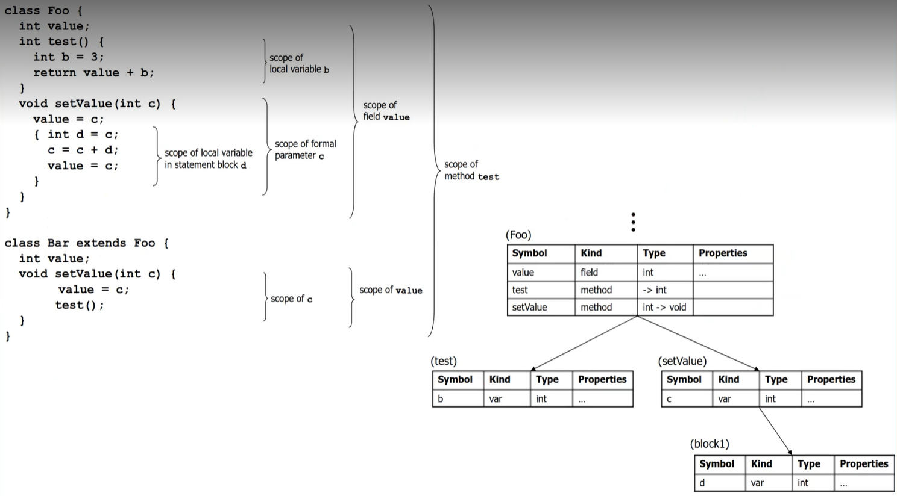
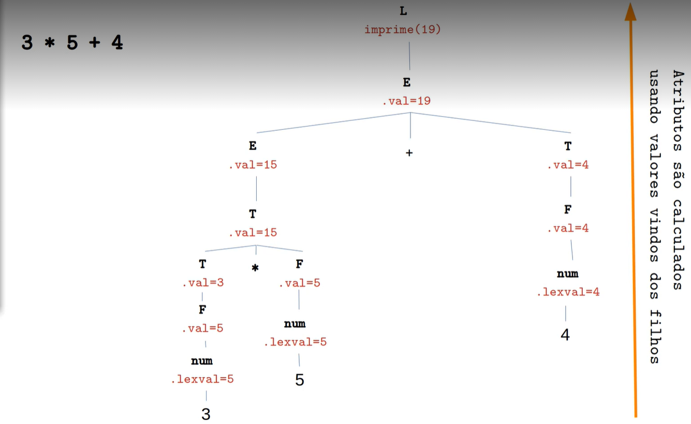

### <b>CORREÇÕES A SEREM FEITAS</b> ###
- Erros léxicos

</br>

### <b>ANÁLISE SEMÂNTICA</b> ###
- É responsável por verificar aspectos relacionados ao significado das instruções
    - Trabalha no nível de inter-relacionamento entre partes distintas do programa
- Validação de um série de regras que não podem ser verificadas nas etapas anteriores
    - Não é possível representar com expressões regulares ou com uma gramática livre de contexto
    - Algumas situações dependem de contexto
- Garantir que o programa fonte esteja coerente e o mesmo possa ser convertido para linguagem de máquina

</br>

### <b>O que é tratado pelo Analisador Semântico?</b> ###
- Declaração prévia de variáveis e procedimentos
- Escopo dos identificadores
- Unicidade (o identificaor é único no escopo)
- Uso de variáveis (X é declarado mas nunca é utilizado)
- Sistema de Tipos
    - Compatibilidade de tipos em operações
    - Conversões
    - Dimensão de vetores/matrizes
    - Passagem de parâmetros (quantidade, posição, tipos)
    - Retorno de funções
- Detectar o uso correto de comandos de controle de fluxo (break, continue) <b>➡ NÃO TEMOS</b>

- Exemplo:</br>
    
    <i>O seguinte código:</i>
    ```c 
    int f1(int a, float b) {
        return a%b;
    }
    ```

    <i>Irá apresentar tais erros:</i>
        ```In function 'f1': ...: invalid operands to binary %```

    <i><b>Pois tentou fazer uma operação entre número inteiro e float.</b></i>

</br>

### <b>Tabela de Símbolos</b> ###
- As informações são coletadas de modo incremental pelas fases de análise, e usadas pelas fases de síntese para gerar o código objeto

- A tabela de símbolos é pesquisada cada vez que <b>um nome</b> é encontrado no programa fonte
    - Alterações são feitas na tabela de símbolos sempre que um novo nome ou nova informação sobre um nome já existente é obtida

- As entradas a tabela de símbolos contêm informações sobre um identificador:
    - Nome ou lexema
    - Tipo
    - Escopo
    - Etc

- Com isso, é possível concluir que a tabela de símbolos serve como um banco de dados para o processo de compilação

- Uma tabela de símbolos <b>pode servir</b> aos seguintes propósitos, dependendo da linguagem:
    - Para armazenar os nomes de todas as entidades em uma forma estruturada em um só lugar
    - Para verificar se uma variável foi declarada
    - Para implementar a verificação de tipo, verificando se as atribuições e expressões no código-fonte estão semanticamente corretas
    - Para determinar o escopo de um nome (resolução de escopo)

- As seguintes <b>informações</b> possíveis sobre identificadores <b>são armazenadas na tabela</b> de símbolo:
    - Nome da variável, constante, função, classe, etc.
    - Tipo de dado
    - Seu escopo (global, local ou parâmetro)
    - Tamanho e limites (vetores e matrizes)
    - Entre outros...
    
    </br>

    

    </br></br>

- <b>Principais Operações:</b>
    - <b>Inserir</b>
        - Armazena informações fornecidas pelas declarações
        - A função ```inserir()``` pega o símbolo e seus atributos como argumentos, e armazena as informações na tabela de símbolos
        - Por exemplo:
            ```c 
            int a;
            ```

            Será processado pelo compilador como:
            ```inserir(a, int)```
    
    - <b>Verificar</b> (lookup)
        - Recupera informação associada a um elemento declarado quando esse elemento é utilizado
        - A operação ```verificar()``` é usada para pesquisar um nome a tabela de símbolos para determinar-se:
            - o símbolo existe na tabela
            - foi declarado antes de ser usado
            - o nome foi usado no escopo
            - se o símbolo for inicializado
            - se o símbolo for declarado várias vezes
        
        - O formato básico deve corresponder ao seguinte: ```verificar(simbolo)```
        - Retorna 0 (zero) se o símbolo não existir na tabela
            - Se o símbolo existe, ele retorna os atributos armazenados na tabela
    
    - <b>Remover</b>
        - Remove (ou torna inacessível) a informação a respeito de um elemento declarado quandoe esse não é mais necessário

</br>

- <b>Implementações da Tabela</b>
    - Lista
    - Árvore
    - Hash (mais usado)
        - O próprio símbolo do código-fonte é tratado como uma chave para a função hash, e o valor de retorno é a informação sobre o símbolo

</br>

- <b>Controle de Escopo</b>
    - Um compilador mantém dois tipos de tabela de símbolos:
        - 1) Tabela de Símbolos Global - que pode ser acessada por todos os procedimentos
        - 2) Tabela de Símbolos de Escopo - que são criadas para cada escopo no programa

        </br>

        

        </br>

        

        </br></br>

### <b>Tradução Dirigida pela Sintaxe</b> ###
- Técnica de especificação de compiladores que permite associar ações semânticas às regras da gramática
- Tradução <b>concomitante com a análise sintática</b>

</br>

- <b>Gramática de Atributos</b>
    - Uma gramática de atributos é uma formalização que permite definir os atributos para as produções de uma gramática formal, associando estes atributos com valores
    - A avaliação ocorre nos nodos da <b>árvore sintática abstrata</b>, quando a linguagem é processada por algum analisador sintático
        - <i>Tradução dirigida pela sintaxe</i>
    - É uma GLC acrescida de um conjunto de <b>atributos</b> e <b>regras semânticas</b>

</br>

- <b>Atributos</b>
    - Acrescentam informação aos símbolos da gramática que representam alguma construção da linguagem
    - Os atributos podem ser valores, tipos de dados, instruções gerados, tamanhos, etc.
    - Podem ser implementados como um registro (estrutura)
    - Considerando que <b>id</b> é um símbolo da gramática, exemplos de atributos são:
        - <b>id.</b>nome = 'a'
        - <b>id.</b>tipo = int
        - <b>id.</b>valor = 50

    - Para cada instância distinta de um símbolo gramatical, haverá uma instância separada do atributo
        - Exemplo: </br>
            </br>
            
</br>

- <b>Regras Semânticas</b>
    - Notação para conectar fragmentos de programa às produções de uma gramática
    - Cada produção está associada a um conjunto de ações semânticas
        - Cálculo dos valores dos atributos
    - Quando uma produção é processada, essas ações são executadas
    - A execução dessas ações pode
        - Gerar ou interpretar código
        - Manipular a tabela de símbolos
        - Emitir mensagens de erro
        - Etc
    - Exemplos: </br>
            </br>
            </br>
            </br>
            </br>

</br>

- <b>Atributos Sintetizados e Herdados</b>
    - <i>Sintetizados:</i>
        - Uma atributo é sintetizado se todas as suas dependências apontarem de filho para pai na árvore sintática
        - <i>b</i> é um <i>atributo sintetizado</i> se ele é um atributo do símbolo do lado esquerdo da produção e depende de atributos associados aos símbolos do lado direito da produção
        - Por exemplo:
            - A → BC é uma produção de uma gramática, e o atributo de A depende dos atributos de B ou de C
    - <i>Herdados:</i>
        - Um atributo não sintetizado é dito herdado
        - São definidos em termos do pai e/ou irmão do nó
        - <i>b</i> é um <i>atributo herdado</i> se ele é um atributo de um dos símbolos do lado direito da produção
        - Por exemplo:
            - A → BC é uma produção de uma gramática e o atributo de B depende dos atributos de A ou de C

</br>

- <b>Tipos de Esquema de Tradução</b>
    - <i>Esquemas S-Atribuídos <b>É O NOSSO CASO</b></i>
        - Possuem apenas atributos sintetizados
        - Implementados por meio de extensões de analisadores Bottom-Up
            - Sempre que ocorre uma redução, são computados os atributos do símbolo do lado esquerdo da produção, a partir dos atributos que estão na pilha
        - Apresentam suas ações semânticas à direita das regras de produção
        - Um esquema deixa de ser S-Atribuído se tiver pelo menos um atributo herdado</br></br>
            </br>
            </br>

    - <i>Esquemas L-Atribuídos</i>
        - Implementados por meio de extensões de analisadores Top-Down
            - Mais apropriados para esse tipo de analisador
            - A implementação de definições L-Atribuídas em analisadores Bottom-Up requer a reescrita das definições
        - As ações semânticas são colocadas em qualquer lugar no lado direito da produção
        - Combina atributos herdados e sintetizados
        - Restrição:
            - Um esquema é L-Atribuído se cada atributo herdade de Xj do lado direito de A → X1, X2, ..., Xn depende apenas de:
                - dos atributos de X1, X2, ..., Xj-1 (irmãos à esquerda)
                - dos atributos herdados de A
                - Por exemplo:
                    - A → XYZ { X.S = A.S, Y.R = X.S, <i>Y.S = Z.S</i> } não é L-Atribuída pois Y.S = Z.S, viola a definição e herda o valor de seu irmão direito</br></br>

                </br>
                </br>

</br>

### <b>Árvores Sintáticas Abstratas (ACHO Q É MAIS JOGO FAZER ESSE ESQUEMA DE TRADUÇÃO)</b> ###
- Representam estruturas sintáticas de cadeias, de acordo com alguma gramática formal
- A sintaxe é abstrata no sentido de que ela não representa cada detalhe que aparece na sintaxe real
- Forma de <b>representação intermediária de código</b>
- Os nós são diretamente valorados em seus símbolos <b>terminais</b>
    - É chamada de abstrata porque não precisa representar detalhadamente todas as derivações
    - Cada nó da árvore denota um construtor no código fonte</br>

        </br>
        </br>

- É possível escrever um esquema de tradução para construir uma árvore sintática de uma expressão
    - <i>Esquema S-Atribuído</i></br>
        </br>
        - Atributos ```ptr``` associado a E e T guardam os ponteiros retornados pelas funções
        - Funções:
            - ```cria_no(op, direita, esquerda)```
                - Cria um nó com o operador igual a op e dois campos com ponteiros para as subárvores esquerda e direita
            - ```cria_folha(id, entrada_TS)```
                - Cria um nó com identificador com label id e um campo contendo a entrada da Tabela de Símbolos
            - ```cria_folha(num, val)```
                - Cria um nó com número com label id e um campo contendo o valor
        - <i><b><a href="https://unioestebr.sharepoint.com/:v:/r/sites/o365.Csc2151Csc0050ClgInf-Csc.2020a.4-1/Documentos%20Compartilhados/General/Recordings/An%C3%A1lise%20Sem%C3%A2ntica%20-%20Parte%202-20210528_152616-Grava%C3%A7%C3%A3o%20de%20Reuni%C3%A3o.mp4?csf=1&web=1&e=ge786i">Exemplo de como funciona aos 0h42h00</a></b></i>

</br>

### <b>Implementação dos Esquemas <i>S-Atribuídos</i> e <i>L-Atribuídos</i></b> ###
- <i>Implementação Bottom-Up</i>
    - O valor dos atributos pode ser controlado pela pilha sintática em um parser bottom-up <b>!!!</b>
        - É feita um modificação na pilha para que além dos símbolos, colocar também os valores dos atributos de cada elemento que está na pilha
    - A cada redução, o valor de um atributo sintetizado é calculado a partir dos símbolos empilhados que aparecem do lado direito da produção
        - Considere a produção:
            ``` A → XYZ { A.a := f(X.x, Y.y, Z.z) } ```
            - Quando ```X Y Z``` estiver na pilha, ocorre a redução para <b>A</b>
            - Os atributos <b>X.x</b>, <b>Y.y</b> e <b>Z.z</b> estão na pilha, então <b>A.a</b> pode ser computado
            - Usamos uma pilha aumentada com uma nova coluna para armazenar os atributos</br>
                </br>
                </br>

            - Quando o analisador reduz ``` F → dígito      { [topo] := dígitolexval } ```, o valor de digito é armazenado em ```[topo]```.
            - Quando uma produção com símbolos <i>n</i> do lado direito é reduzida, o valor de ```[ntopo]``` é atualizado para ```[topo(n-1)]```.
            - Após cada ação, ```[topo]``` é atualizado por ```[ntopo]```.</br>
                </br>

- <i>Implementação dos L-Atribuídos</i>
    - Note que um esquema S-Atribuído é necessariamente L-Atribuído, pois suas restrições se aplicam somente aos atributos herdados
    - Definições em que os atributos são sempre avaliados em uma ordem de pesquisa em profundidade <i>(depth-first)</i>
    - Algoritmo: </br>
        </br>
    - Cuidado na ordenação das ações semânticas:
        - Deve-se assegurar que os valores dos atributos já tenham sido calculados quando as ações referirem-se a eles
        - Se há apenas atributos sintetizados, consegue-se colocando as ações semânticas após o lado direito da produção
        - Senão:
            1) Atributo <u>herdado</u> associados ao lado direito deve ser computado em ação semântica especificada <u>antes desse símbolo</u>
            2) Uma ação semântica só pode referir a atributo <u>sintetizado</u> de símbolo que apareça à <u>esquerda</u> dessa ação
            3) Atributos sintetizados de não-terminal do lado esquerdo da produção deve ser computado depois de serem computados todos os atributos que ele referencia</br></br>
        
        </br>
        </br>
    
    - Implementação de esquema para análise Top-Down
    - Transformação Bottom-Up → Top-Down
    - Gramática LL(1):
        - Retirada da recursão à esquerda exige a mudança das ações semânticas
            - Generalização da transformação Bottom-Up para Top-Down
                - Considere o esquema S-Atribuído:
                ```
                A → A1 Y { A.a = g(A1.a, Y.y) }
                A → X    { A.a = f(X.x) }
                ```
                Eliminando a Recursividade:
                ```
                A → X R
                R → Y R | ε
                ```
            - As ações semânticas também precisam ser modificadas</br>
                </br>

- <i>Exemplo:</i> </br>
    </br>
    </br>
    </br>
    </br>
    </br>
    </br>

</br>

### <b>PREVIEW DO ARQUIVO README</b> ###
- <i>CTRL+SHIFT+V</i>

</br>

### <b>MARKDOWN SYNTAX</b> ###
- https://daringfir eball.net/projects/markdown/syntax


